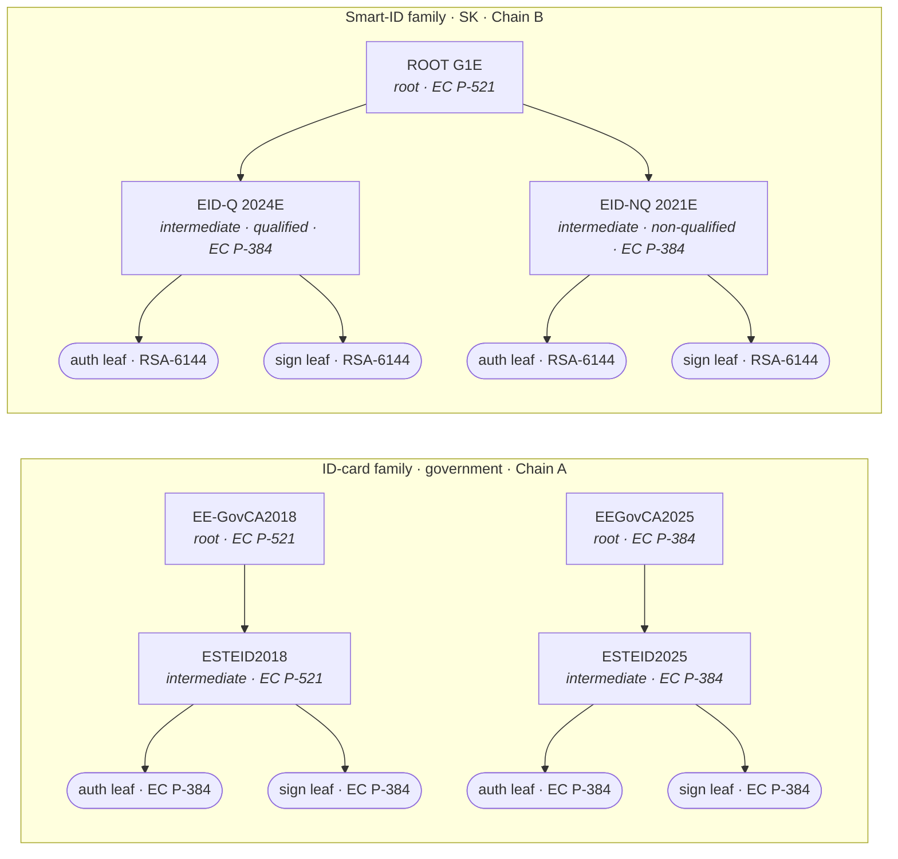
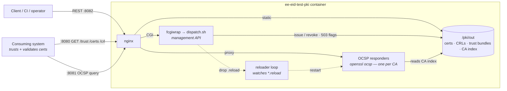

# ee-eid-test-pki

A Docker-packaged **test PKI** that reproduces the real Estonian eID certificate hierarchies as faithfully as possible,
for testing systems that consume Estonian eID. It issues natural-person authentication + signature certificates, serves
CRLs, OCSP and trust bundles, and exposes a small management API to issue / fetch / revoke identities and simulate
revocation-endpoint outages.

> **Test only.** The CA keys are non-secret and committed to the repo on purpose, to give a
> stable shared trust anchor across rebuilds.

## Status

- **ID-card** family complete — current `EEGovCA2025 → ESTEID2025` (EC P-384)
  and legacy `EE-GovCA2018 → ESTEID2018` (EC P-521), each issuing an auth + sign leaf.
- **Smart-ID** family complete — SK `ROOT G1E` with `EID-Q 2024E` (qualified) and
  `EID-NQ 2021E` (non-qualified), RSA-6144 leaves. Sample leaves are opt-in (`SMARTID_SAMPLE=1`), so the default image
  ships chain B's CAs but no baked Smart-ID identities.
- **Mobile-ID** family is planned — see the [roadmap](docs/ROADMAP.md).

Our CAs use a neutral `O=EE eID Community Test PKI` identity and a `COMMUNITY` / `community-`
naming prefix so they never collide with the real production/test CAs.

## CA hierarchies

Currently supported chains (all CAs carry the `COMMUNITY` / `community-` prefix, shown short here). Every identity is
two leaves — an authentication and a signature certificate — under its issuer.



## Quick start (Docker)

```bash
docker build -t ee-eid-test-pki .
docker run --rm -p 8080:8080 -p 8081:8081 -p 8082:8082 ee-eid-test-pki
# or: docker compose up --build
```

Or pull the prebuilt image (default test CAs) from GHCR — no build needed:

```bash
docker run --rm -p 8080:8080 -p 8081:8081 -p 8082:8082 ghcr.io/test-government/ee-eid-test-pki:latest
```

| Port | What it serves |
|---|---|
| 8080 | HTTP — CA certs (`/certs/<ca>.crt`, DER), CRLs (`/crl/<ca>.crl`), trust bundles (`/trust/`) |
| 8081 | OCSP — one responder per CA (`/<ca>`) |
| 8082 | Management API (**test only**) — toggle OCSP/CRL, issue / fetch / revoke leaves; Swagger UI at `/docs`, spec at `/openapi.yaml` |

## Runtime architecture

A single container fronts everything with nginx: static files on :8080, per-CA OCSP responders
on :8081, and the management API (fcgiwrap → `dispatch.sh`) on :8082. Issued leaves bake their
AIA / CRL / OCSP URLs pointing back at :8080 / :8081, so a consuming system resolves revocation
data from the same container it trusts.



## Build locally (without Docker)

Requires OpenSSL 3.x and bash (on Windows, Git-Bash).

```bash
pki/scripts/build-idcard.sh    # build both chains + a sample identity
pki/scripts/verify-idcard.sh   # decode + chain-verify (read-only)
```

## Layout

- **`pki/`** — the generation toolkit: data-driven OpenSSL scripts, the CA registry, templates, and committed pinned
  fixtures. See [pki/README.md](pki/README.md).
- **`docker/`** — container packaging & init (`entrypoint.sh`, `smoke-test.sh`).
- **`management/`** — the management console served on :8082 (for now API only, UI planned). See
  [management/README.md](management/README.md).
- **`docs/`** — [`docker.md`](docs/docker.md) (running & consuming the image),
  [`real-world-pki.md`](docs/real-world-pki.md) (AI composed real world reference for basis), and [
  `ROADMAP.md`](docs/ROADMAP.md) (planned work).
